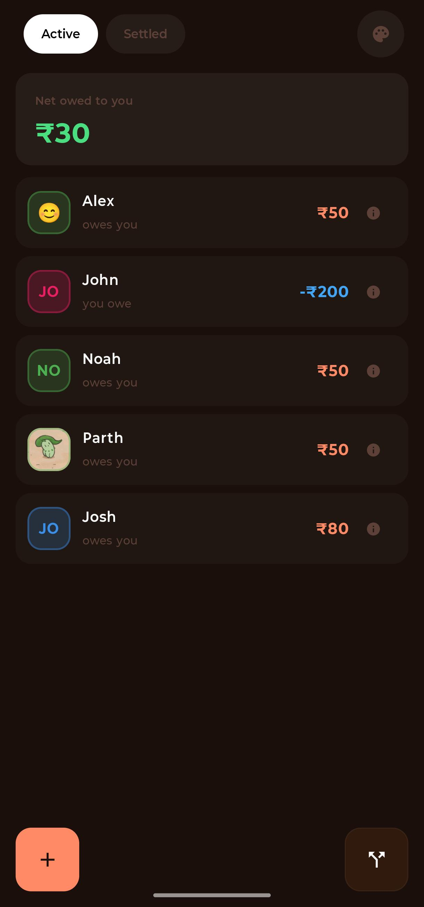
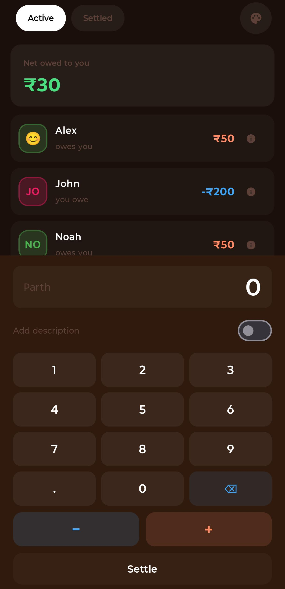
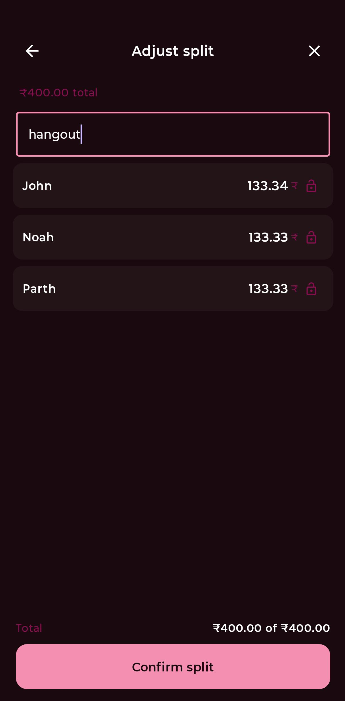
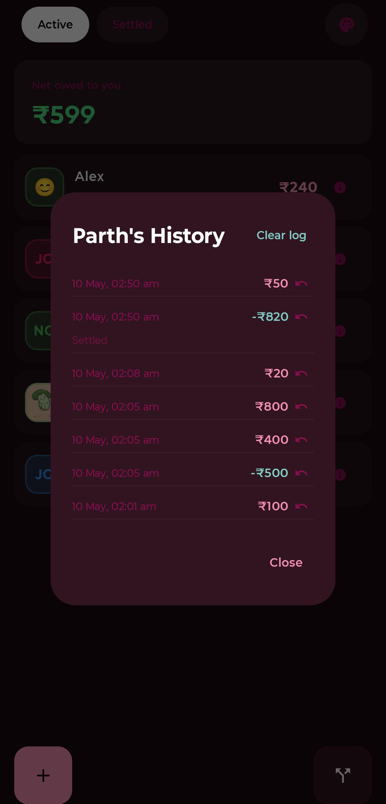

# MeraPaisa

> A personal IOU tracker for Android. Track who owes whom across multiple currencies, split shared bills, and remind people to settle up — all with your data backed up automatically.

## 📸 Screenshots

  
  
  
  

## ✨ Features

| Feature | Details |
|---------|---------|
| 💸 **Per-person balances** | Each person has their own currency, profile picture, and full transaction history |
| 🌍 **Multi-currency** | ₹, $, €, £, ¥ with live conversion via [Frankfurter](https://www.frankfurter.app/) |
| ➗ **Bill splitting** | Equal or custom amounts, with Splitwise-style lock-on-edit redistribution |
| 📋 **Transaction history** | Notes, timestamps, rollback to any past entry, and clear-log option |
| 🔔 **Reminders** | Long-press → auto-generated message you can edit, optionally with full history attached |
| 🎨 **Theming** | Multiple themes via the top-bar palette icon |
| ☁️ **Auto Backup** | Restores on a new device with the same Google account — no login required |
| 📱 **Adaptive UI** | Adjusts spacing for gesture vs three-button navigation |

## 💸 Track balances

- Add people with names, profile pictures, and a default currency
- Add or subtract amounts via a custom numpad with optional notes ("dinner", "cab fare")
- Active and Settled tabs — people automatically move between them as their balance hits or leaves zero
- Settle a person in one tap; the balance zeros out and a settlement entry is logged

## 🌍 Multi-currency

Each person has their own currency, and balances stay in that currency — no silent conversions. When splitting bills among people in different currencies, amounts are converted live using the Frankfurter API and recorded in each recipient's own currency.

## ➗ Bill splitting

1. Tap the Split button, enter the total amount
2. Pick people from a list (including yourself if you want to be part of the split)
3. Add new people directly from the picker — they auto-select for the split
4. Adjust per-person amounts on the next screen
    - Equal split by default, leftover paisa go to the first person
    - Edit any row → that row locks; remaining unlocked rows redistribute the rest
    - Lock/unlock manually with the lock icon
5. Optional description gets attached to every transaction created

If amounts don't add up, a warning shows but you can still confirm — your call.

## 📋 Transaction history & rollback

- Per-person log with timestamps and notes
- Rollback any transaction (and all newer ones) — adds a reversal entry rather than deleting
- Clear log entirely with confirmation; the current balance is preserved

## 🔔 Reminders

Long-press a person's name → "Send reminder" → an auto-generated message appears (e.g. "Hey Alex, friendly reminder you owe me ₹500"). Edit it if you like, optionally include the full transaction history with running balance, and tap Share. Goes through Android's share sheet, so it works with WhatsApp, SMS, email, or anything else.

## ☁️ Backup & restore

Uses Android's built-in Auto Backup. Data is automatically backed up to the user's Google account when the device is idle and on Wi-Fi. Reinstalling on a new device signed into the same Google account restores all data automatically — no login screen, no separate sync server, no setup.

## 🛠 Tech stack

- **Kotlin** + **Jetpack Compose** (Material 3)
- **Room** for local persistence
- **Coroutines** + **Flow** for async + reactive state
- **Frankfurter API** for currency conversion

## 🚀 Build

1. Clone the repo
2. Open in Android Studio (Hedgehog or newer)
3. Sync Gradle, build, run

`minSdk 24` (Android 7.0+).

## 📝 Status

Personal project, actively iterated. No external contributions expected, but feel free to fork.

## 📄 License

MIT — see [LICENSE](LICENSE) file.