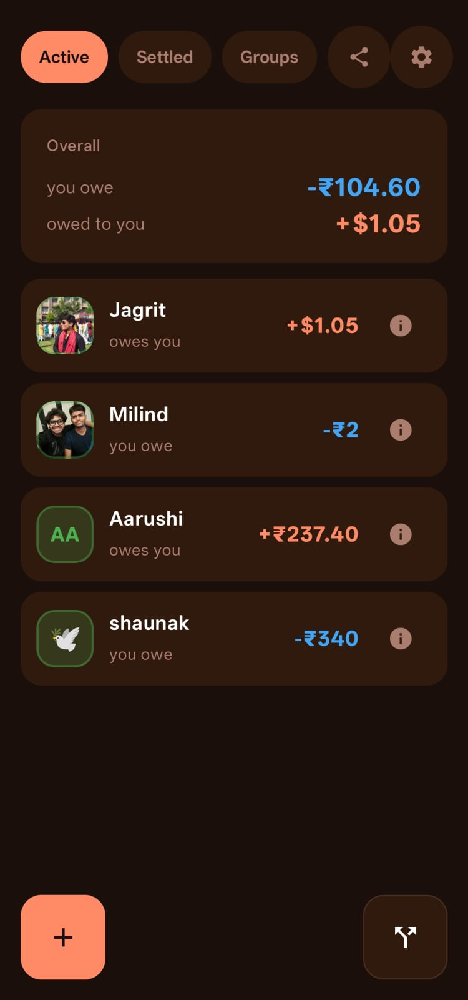
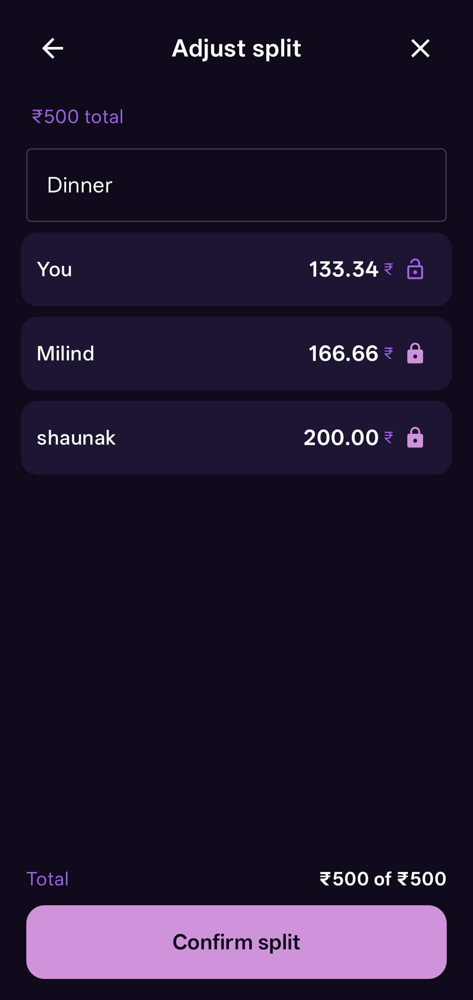
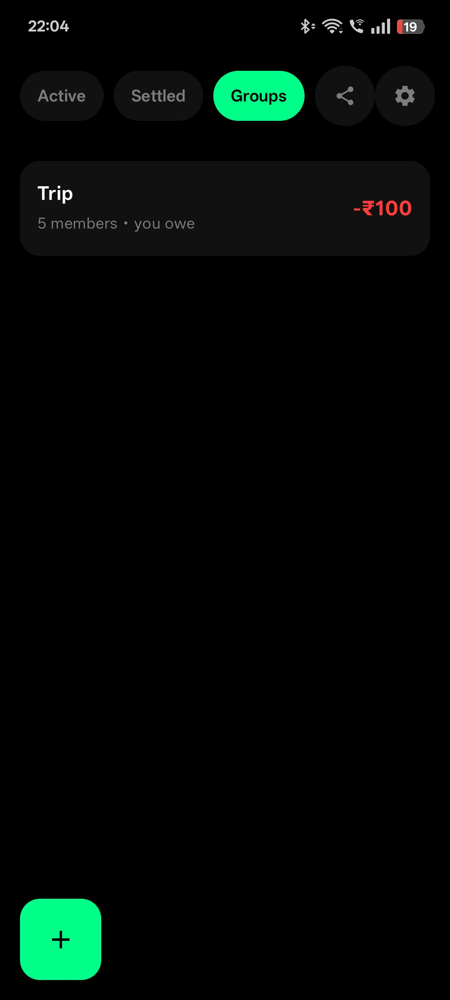

<div align="center">

<picture>
  <source media="(prefers-color-scheme: dark)" srcset="docs/assets/hero-dark.svg">
  <source media="(prefers-color-scheme: light)" srcset="docs/assets/hero-light.svg">
  
</picture>

<br>

[](https://github.com/Parth-KG/MeraPaisa/releases/latest)

[](#-build-from-source)
[](#-tech)
[](#-tech)
[](LICENSE)

<br>

<table>
<tr>
<td align="center" width="33%"><br><sub><b>💸 Balances</b><br>one figure per currency, never summed</sub></td>
<td align="center" width="33%"><br><sub><b>➗ Split</b><br>edit one share, the rest redistribute</sub></td>
<td align="center" width="33%"><br><sub><b>👥 Groups</b><br>a trip, in Amoled — one of six themes</sub></td>
</tr>
</table>

</div>

---

## ⬇️ Install

Grab the APK from the **[latest release](https://github.com/Parth-KG/MeraPaisa/releases/latest)** and open it on your phone. Android 7.0 or newer.

Android will warn you about installing outside the Play Store — expected for a directly distributed APK. You'll need to allow installs from your browser or file manager once.

Every release lists the APK's SHA-256; run `shasum -a 256` on the file if you'd rather verify than trust.

> **Updating?** Install over the top. Every schema change ships with a tested migration, so an update carries your ledger forward — but uninstalling deletes it, so don't uninstall first.

## 🤔 Why

Splitting a bill is easy. Remembering it three weeks later is not — and every app that solves it wants an account, a phone number, and a copy of who you owe money to.

MeraPaisa keeps all of that on your phone.

## ✨ Features

| | |
|---|---|
| 💸 **Per-person balances** | Own currency, profile picture, and full transaction history for each person |
| 🧮 **Net position** | What you're up or down overall, one figure per currency — never added together across currencies |
| 🌍 **Multi-currency** | ₹, $, €, £, ¥ with live rates from [Frankfurter](https://www.frankfurter.app/) — balances stay in each person's currency, never silently converted |
| ➗ **Bill splitting** | Equal or custom amounts, with Splitwise-style lock-on-edit redistribution |
| 👥 **Groups** | A trip or a flatshare — log who paid for what, then square everyone up in the fewest payments |
| ✅ **Settle up** | Close a debt in one tap; reopen it later without losing the record |
| 📋 **Transaction history** | Notes, timestamps, per-entry edit and delete, rollback, and a clear-log option |
| 📤 **Export & share** | Whole ledger to CSV, or one person's balance and recent activity as text for WhatsApp |
| 🔔 **Reminders** | Long-press a name for an editable message, optionally with the full history attached |
| 🏠 **Home screen widget** | Active debts and your net position, in your chosen theme, light or dark |
| 🎨 **Six themes** | Midnight, Amoled, Ocean, Sunset, Purple and Paper — every one meets WCAG AA contrast |
| ☁️ **Auto Backup** | Restores on a new device with the same Google account — no login required |

## 🔍 Worth a closer look

> **🪙 Money is never a floating-point number**
> Amounts are stored as whole minor units — paise, cents — not `Double`. `10.50` is `1050`, and it is still `10.50` after a hundred additions. Currencies with no minor unit in circulation, like the yen, are stored the same way and only lose their decimals when displayed.

> **🧾 The balance is not a stored number**
> There is no balance column to drift out of step with the history. A balance is the sum of that person's transactions, derived on read, so the number on screen and the entries behind it cannot disagree.

> **🛡️ An update never changes what you're owed**
> The database has been through six schema versions. Every one has a hand-written migration, tested against a seeded database before release — there is no destructive fallback anywhere, so no update can wipe a ledger. The version that removed the stored balance column had to prove first that the transactions summed to it, and wrote a reconciling entry where they didn't.

> **🔒 Lock-on-edit redistribution**
> Change one person's share and that row locks; the remaining unlocked rows split what's left. Leftover paisa go to the first person rather than quietly disappearing. If the numbers don't reconcile you get a warning, not a block — sometimes you really do mean it.

> **👥 Squaring a group in the fewest payments**
> Inside a group, who paid whom for any single expense stops mattering once you only care about ending square — all that survives is each member's net position. If A owes B and B owes C the same amount, B is a pass-through and A can just pay C. Matching the largest debtor against the largest creditor settles at least one person with every payment, so a group of *n* people never needs more than *n−1* transfers.

> **🔐 No account, no backend**
> Data lives in Room on the device and rides Android's own Auto Backup to your Google account. Reinstall on a new phone signed into the same account and everything is there — no sign-up screen, no sync server, nothing of yours on a machine I control. The app makes exactly one kind of network call, for exchange rates, and only when you ask it to convert something: the amount and the two currency codes go to Frankfurter, and nothing else about you does. No names, no notes, no analytics, no crash reporting. The manifest asks for one permission, `INTERNET`, and that is what it is for — not contacts, not storage, not location.

<details>
<summary><b>📖 How each part works</b></summary>

<br>

### 💸 Balances

Add people with names, profile pictures, and a default currency. Add or subtract amounts through a custom numpad with optional notes — "dinner", "cab fare". The top of the list shows where you stand overall, grouped by currency.

### ✅ Active, Settled, and settling up

A person is in **Settled** because you put them there, not because their balance happened to reach zero. **Settle up** records a closing entry for exactly what is outstanding and files them away; **Reopen** brings them back without resurrecting the old balance, since the closing entry is real history and stays. Recording money against a settled person reopens them automatically — if you're lending again, the debt is live again.

### 🌍 Multi-currency

Each person has their own currency and balances stay in it. Your net position is reported per currency and never summed across them: a rate is a guess about a day, and folding ₹ and $ together would report a number nobody actually owes. When a split crosses currencies, amounts convert live through the Frankfurter API and are recorded in each recipient's own currency.

### ➗ Splitting a bill

1. Tap **Split**, enter the total, and pick the currency it's in.
2. Choose people from the list — including yourself, if you're part of it.
3. Add new people straight from the picker; they auto-select for the split.
4. Adjust per-person amounts on the next screen. Equal by default. Editing a row locks it and redistributes the remainder across the unlocked rows; the lock icon toggles this manually.
5. An optional description attaches to every transaction the split creates.

### 👥 Groups

A group is a trip, a flatshare, a dinner — anything where several people keep paying for things on each other's behalf. You are always a member; a trip you are not part of is somebody else's ledger.

Log an expense with a description, an amount, and who paid. Shares are equal by default and split so the parts always add back up to the whole — paise cannot be divided three ways, so the odd minor unit goes to the first member rather than quietly disappearing. Every member's position is what they paid out less what they were assigned, so the group always nets to zero.

**Settle up** turns those positions into an actual list of payments — *"Alex pays Priya ₹430"* — and records each one when it happens. Deleting a group takes its expenses and shares with it.

### 📋 History, corrections and rollback

Every person has a log with timestamps and notes. Tap an entry to correct its amount or note, or delete it outright — a mistyped figure doesn't have to live in the history forever. **Rollback** is the bulk version: it reverses a transaction and everything newer by writing compensating entries rather than deleting rows, so the correction stays visible as a correction. Clearing the log needs a confirmation and carries the balance across as an opening entry, so what you're owed never changes.

### 🛡️ Schema changes and updates

The ledger is the whole value of the app and there is no copy of it on a server, so an update has to be incapable of damaging it.

Room's escape hatch for a changed schema is to drop the database and rebuild it. That is disabled here. Every one of the six schema versions has a migration written by hand, and each is tested by creating a database at the old version, seeding it with rows in the old shape, running the real migration and asserting on the result — including that the resulting schema is exactly what Room expects, so a subtly wrong migration fails a test rather than a phone.

The interesting one is version 4, which removed the stored balance column. Dropping it is only safe if the transactions already sum to it, and in real ledgers they sometimes didn't — early versions wrote balances without logging an entry. So the migration compares each person's rows against their stored balance first and writes a single reconciling entry for any difference, dated before their earliest transaction. Nobody's balance moved. That is also why there is no balance column now: the two numbers could disagree, so one of them had to go.

### 📤 Export and sharing

**Export** writes the whole ledger — every person, every transaction — to CSV and hands it to the share sheet. **Share summary** sends one person's position and recent activity as plain text, with the running balance after each entry, ready to paste into a chat.

### 🔔 Reminders

Long-press a person's name and choose **Send reminder**. An auto-generated message appears — *"Hey Alex, friendly reminder — you owe me ₹500."* — which you can edit, and optionally attach the full transaction history. It goes out through Android's share sheet, so WhatsApp, SMS, email and anything else all work.

### 🎨 Themes

Six, chosen so no two look alike: **Midnight**, **Amoled**, **Ocean**, **Sunset**, **Purple** and **Paper**. Secondary text clears the WCAG AA 4.5:1 contrast ratio on every one, against both the background and the card behind it — enforced by a test, not by eye. Owed and owing carry an explicit `+` or `−` so the direction never rests on telling green from red.

### ☁️ Backup and restore

Android's built-in Auto Backup handles this: the database and your preferences go to your Google account when the device is idle and on Wi-Fi. Reinstalling on a new device signed into the same account restores everything. No login screen, no separate sync service, no setup. The CSV export is the manual belt-and-braces version.

</details>

## 🛠 Tech

**Kotlin** + **Jetpack Compose** (Material 3) · **Room** with KSP and tested migrations · **Glance** for the widget · **DataStore** for preferences · **Coil** for images · **Coroutines** + **Flow** for async and reactive state · **[Frankfurter](https://www.frankfurter.app/)** for exchange rates

Single `:app` module, split into `data` (entities, DAO, migrations, money), `repository` (the only thing that touches the ledger), `network`, `ui` and `widget`.

89 tests — 67 on the JVM covering money arithmetic, settle-up, per-currency totals, CSV, summaries and theme contrast, and 22 instrumentation tests covering every schema migration and the settle, reopen, rollback, edit and delete paths against a real database.

## 🚀 Build from source

```bash
git clone https://github.com/Parth-KG/MeraPaisa.git
cd MeraPaisa
./gradlew :app:assembleDebug
```

Needs **JDK 17** or newer. `minSdk 24`, `compileSdk 36`, AGP 8.13. Opening in Android Studio and hitting run works too.

```bash
./gradlew testDebugUnitTest          # JVM tests
./gradlew connectedDebugAndroidTest  # needs a device or emulator
```

Debug builds install as `com.kg.merapaisa.debug`, alongside a release build rather than replacing it — so testing can't put a real ledger at risk. Release signing is described in [docs/RELEASE.md](docs/RELEASE.md).

## 📝 Status

A personal project I still use and still change. Issues and forks welcome; I'm not looking for feature PRs.

## 📄 License

MIT — see [LICENSE](LICENSE).

<div align="center">
<br>
<sub>Built by <a href="https://github.com/Parth-KG">Parth Krishan Goswami</a></sub>
</div>
