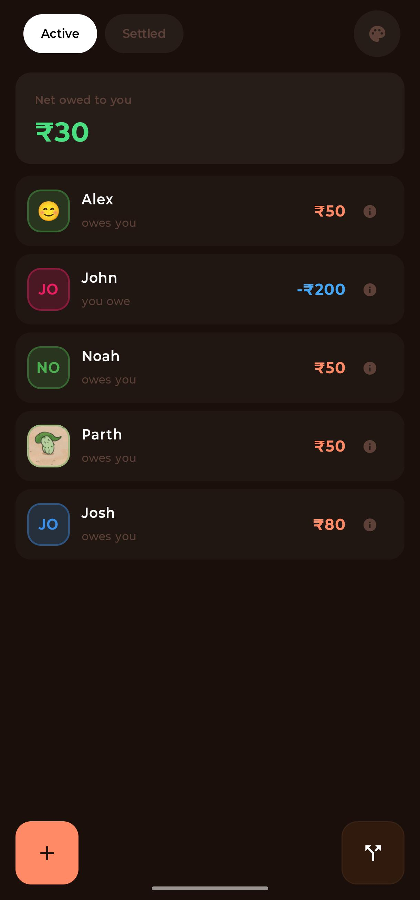
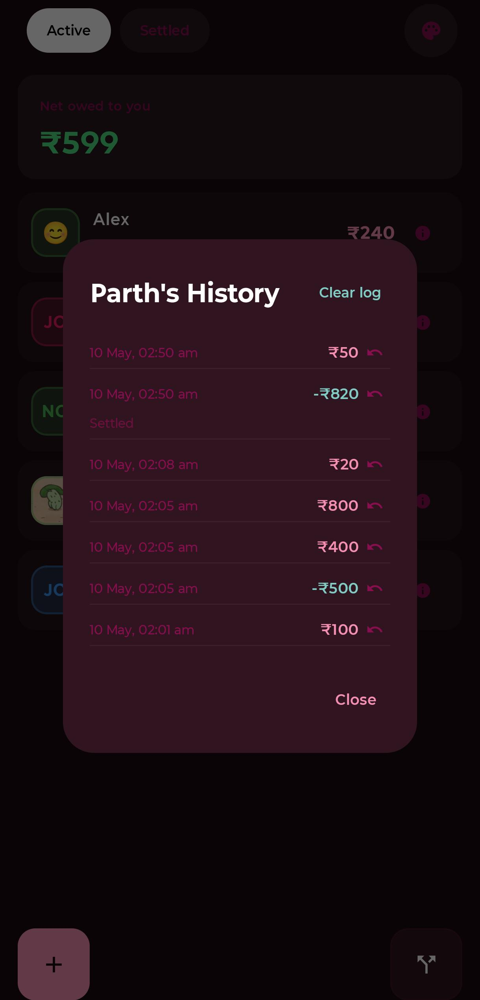

<div align="center">

<picture>
  <source media="(prefers-color-scheme: dark)" srcset="assets/hero-dark.svg">
  <source media="(prefers-color-scheme: light)" srcset="assets/hero-light.svg">
  
</picture>

<br>

[](https://github.com/Parth-KG/MeraPaisa/releases/latest)

[](#-build-from-source)
[](#-tech)
[](#-tech)
[](LICENSE)

<br>

<table>
<tr>
<td align="center" width="33%"><br><sub><b>💸 Balances</b><br>who owes whom, at a glance</sub></td>
<td align="center" width="33%"><br><sub><b>➗ Split</b><br>edit one share, the rest redistribute</sub></td>
<td align="center" width="33%"><br><sub><b>📋 History</b><br>every entry, reversible</sub></td>
</tr>
</table>

</div>

---

## ⬇️ Install

Grab **`merapaisa-v1.0.0.apk`** from the **[latest release](https://github.com/Parth-KG/MeraPaisa/releases/latest)** and open it on your phone. Android 7.0 or newer.

Android will warn you about installing outside the Play Store — expected for a directly distributed APK. You'll need to allow installs from your browser or file manager once.

<sub>SHA-256 · <code>1c41bdf3bc03edf10bae182464bd058964fc62b57df8a1af9e7950d448e0e19d</code> — run <code>sha256sum</code> on it if you'd rather verify than trust.</sub>

## 🤔 Why

Splitting a bill is easy. Remembering it three weeks later is not — and every app that solves it wants an account, a phone number, and a copy of who you owe money to.

MeraPaisa keeps all of that on your phone.

## ✨ Features

| | |
|---|---|
| 💸 **Per-person balances** | Own currency, profile picture, and full transaction history for each person |
| 🌍 **Multi-currency** | ₹, $, €, £, ¥ with live rates from [Frankfurter](https://www.frankfurter.app/) — balances stay in each person's currency, never silently converted |
| ➗ **Bill splitting** | Equal or custom amounts, with Splitwise-style lock-on-edit redistribution |
| 📋 **Transaction history** | Notes, timestamps, rollback to any past entry, and a clear-log option |
| 🔔 **Reminders** | Long-press a name for an editable message, optionally with the full history attached |
| 🎨 **Theming** | Multiple themes from the top-bar palette icon |
| ☁️ **Auto Backup** | Restores on a new device with the same Google account — no login required |
| 📱 **Adaptive UI** | Adjusts spacing for gesture vs three-button navigation |

## 🔍 Worth a closer look

> **🔒 Lock-on-edit redistribution**
> Change one person's share and that row locks; the remaining unlocked rows split what's left. Leftover paisa go to the first person rather than quietly disappearing. If the numbers don't reconcile you get a warning, not a block — sometimes you really do mean it.

> **↩️ Rollback writes a reversal, never a delete**
> Rolling back a transaction reverses it and everything newer by adding compensating entries. The log stays an append-only record of what actually happened, so a correction is always visible as a correction.

> **🔐 No account, no backend**
> Data lives in Room on the device and rides Android's own Auto Backup to your Google account. Reinstall on a new phone signed into the same account and everything is there — no sign-up screen, no sync server, nothing of yours on a machine I control. The only network call the app makes is for exchange rates.

<details>
<summary><b>📖 How each part works</b></summary>

<br>

### 💸 Balances

Add people with names, profile pictures, and a default currency. Add or subtract amounts through a custom numpad with optional notes — "dinner", "cab fare". Active and Settled tabs sort themselves: people move between them automatically as their balance hits or leaves zero. Settling someone takes one tap, zeroes the balance, and logs a settlement entry.

### 🌍 Multi-currency

Each person has their own currency and balances stay in it. When a split crosses currencies, amounts convert live through the Frankfurter API and are recorded in each recipient's own currency — so nobody ends up owing a number they can't recognise.

### ➗ Splitting a bill

1. Tap **Split**, enter the total.
2. Pick people from the list — including yourself, if you're part of it.
3. Add new people straight from the picker; they auto-select for the split.
4. Adjust per-person amounts on the next screen. Equal by default. Editing a row locks it and redistributes the remainder across the unlocked rows; the lock icon toggles this manually.
5. An optional description attaches to every transaction the split creates.

### 📋 History and rollback

Every person has a log with timestamps and notes. Rolling back a transaction reverses it and all newer ones by writing compensating entries rather than deleting rows. Clearing the log needs a confirmation and preserves the current balance.

### 🔔 Reminders

Long-press a person's name and choose **Send reminder**. An auto-generated message appears — *"Hey Alex, friendly reminder you owe me ₹500"* — which you can edit, and optionally attach the full transaction history with a running balance. It goes out through Android's share sheet, so WhatsApp, SMS, email and anything else all work.

### ☁️ Backup and restore

Android's built-in Auto Backup handles this: data goes to your Google account when the device is idle and on Wi-Fi. Reinstalling on a new device signed into the same account restores everything. No login screen, no separate sync service, no setup.

</details>

## 🛠 Tech

**Kotlin** + **Jetpack Compose** (Material 3) · **Room** for local persistence · **Coroutines** + **Flow** for async and reactive state · **[Frankfurter](https://www.frankfurter.app/)** for exchange rates

## 🚀 Build from source

```bash
git clone https://github.com/Parth-KG/MeraPaisa.git
```

Open in Android Studio (Hedgehog / 2023.1 or newer), sync Gradle, run. `minSdk 24`.

## 📝 Status

A personal project I still use and still change. Issues and forks welcome; I'm not looking for feature PRs.

## 📄 License

MIT — see [LICENSE](LICENSE).

<div align="center">
<br>
<sub>Built by <a href="https://github.com/Parth-KG">Parth Krishan Goswami</a></sub>
</div>
