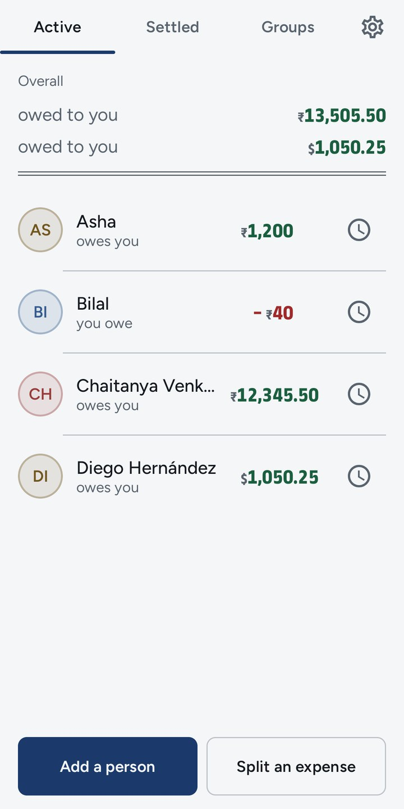
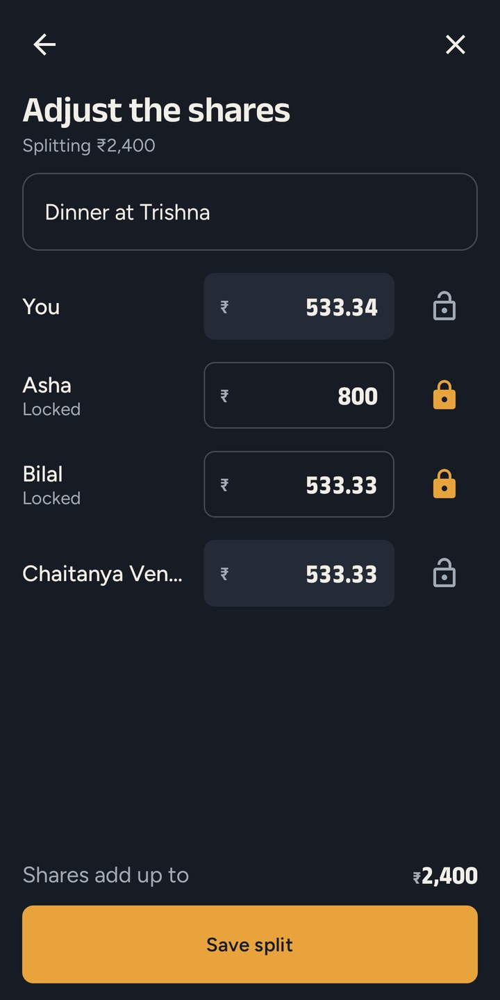
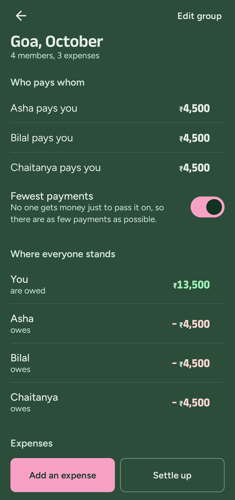

<div align="center">

<picture>
  <source media="(prefers-color-scheme: dark)" srcset="docs/assets/hero-dark.svg">
  <source media="(prefers-color-scheme: light)" srcset="docs/assets/hero-light.svg">
  
</picture>

<br>

[](https://github.com/Parth-KG/MeraPaisa/releases/latest)

[](#build-from-source)
[](#tech)
[](#tech)
[](LICENSE)

<br>

<table>
<tr>
<td align="center" width="33%"><br><sub><b>Balances</b><br>one figure per currency, never summed</sub></td>
<td align="center" width="33%"><br><sub><b>Split</b><br>edit one share, the rest redistribute</sub></td>
<td align="center" width="33%"><br><sub><b>Groups</b><br>a trip, in one of six themes</sub></td>
</tr>
</table>

</div>

---

## Install

Grab the APK from the **[latest release](https://github.com/Parth-KG/MeraPaisa/releases/latest)** and open it on your phone. Android 7.0 or newer.

Android warns about installing outside the Play Store, which is expected for a directly distributed APK. You will need to allow installs from your browser or file manager once.

Every release lists the APK's SHA-256. Run `shasum -a 256` on the file if you would rather verify than trust.

> **Updating?** Install over the top. Every schema change ships with a tested migration, so an update carries your ledger forward. Uninstalling deletes it, so do not uninstall first.

## Why

Splitting an expense is easy. Remembering it three weeks later is not, and every app that solves it wants an account, a phone number, and a copy of who you owe money to.

Mera Paisa keeps all of that on your phone.

## Features

| | |
|---|---|
| **Per-person balances** | Each person has their own currency, picture and history |
| **Net position** | Where you stand overall, one line per currency, never added together |
| **Multi-currency** | ₹, $, €, £, ¥ with live rates from [Frankfurter](https://www.frankfurter.app/). Balances stay in each person's currency and are never silently converted |
| **Expense splitting** | Equal or custom shares, with lock-on-edit redistribution |
| **Groups** | A trip or a flatshare: log who paid for what, then settle everyone in the fewest payments |
| **Settle up** | Close a balance in one tap, and reopen it later without losing its history |
| **History** | Notes, timestamps, edit or delete any entry, reverse an entry and everything newer, or clear the history |
| **Export and summaries** | The whole ledger as CSV, or a plain-text summary of one person's balance |
| **Update links** | Send a link that records the mirror of your entries in their app, and compares before writing |
| **Reminders** | An editable message, optionally with the history attached |
| **Home screen widget** | Your net position and who owes what, in your chosen theme |
| **Six themes** | Midnight, Amoled, Ocean, Sunset, Purple and Paper, each one tested for contrast |
| **Backup** | Everything in one file, saved when you like or every week to a folder you pick, with a preview before any restore. Android's own backup also copies your ledger and settings to your Google account |

## Worth a closer look

> **Money is never a floating-point number**
> Amounts are whole minor units, paise or cents, not `Double`. `10.50` is `1050`, and it is still `10.50` after a hundred additions. Currencies with no minor unit in circulation, like the yen, are stored the same way and only lose their decimals when displayed.

> **The balance is not a stored number**
> There is no balance column to drift out of step with the history. A balance is the sum of that person's entries, derived on read, so the figure on screen and the entries behind it cannot disagree.

> **An update never changes what you are owed**
> The database has been through ten schema versions with seven hand-written migrations, each tested against a seeded database before release. There is no destructive fallback anywhere, so no update can wipe a ledger. The version that removed the stored balance column had to prove first that the entries summed to it, and wrote a reconciling entry where they did not.

> **Lock-on-edit redistribution**
> Change one person's share and that row locks, and the remaining unlocked rows split what is left. Leftover paise go to the first person rather than quietly disappearing. If the shares do not reconcile you get a warning rather than a block, because sometimes you really do mean it.

> **Settling a group in the fewest payments**
> Inside a group, who paid whom for any single expense stops mattering once you only care about ending even. All that survives is each member's net position. If A owes B and B owes C the same amount, B is a pass-through and A can pay C directly. Matching the largest debtor against the largest creditor settles at least one member with every payment, so a group of *n* people never needs more than *n* minus 1 payments. You can turn this off per group and keep every debt attached to the expense that created it.

> **Two ledgers that can disagree, and say so**
> An update link carries a stable id per entry, so the receiving app can tell a new entry from an edited one from one the sender deleted. It shows you the differences and writes nothing you have not ticked. Additions are ticked for you; an edit or a deletion never is, because nothing about a link proves who sent it.

> **No account, no backend**
> Data lives in Room on the device and rides Android's own backup to your Google account, which is a system feature rather than anything of ours. Reinstall on a new phone that uses the same Google account and it is there. There is no account to create, no server, and nothing of yours on a machine I control. Exactly three things leave the phone: that system backup, links and messages you choose to send, and requests to Frankfurter for an exchange rate and GitHub for an update check. No names, no notes, no analytics, no crash reporting. The manifest asks for `INTERNET` for those requests, and `REQUEST_INSTALL_PACKAGES` so the updater can hand a checked APK to Android's installer. Not contacts, not storage, not location.

<details>
<summary><b>How each part works</b></summary>

<br>

### Balances

Add people with names, pictures and a currency. Record amounts through a numpad, with a note if you want one. The top of the list shows where you stand overall, a line per currency, closed with a double rule.

### Active, Settled, and settling up

A person is in **Settled** because you put them there, not because their balance happened to reach zero. **Settle up** records a closing entry for exactly what is outstanding, and a payment in each group where the two of you still owe each other, then files them away. **Reopen** brings them back without resurrecting the old balance, since the closing entry is real history and stays. Recording money against a settled person reopens them: if you are lending again, the balance is live again.

### Multi-currency

Each person has their own currency and balances stay in it. Your net position is reported per currency and never summed across them: a rate is a guess about a day, and folding ₹ and $ together would report a number nobody owes. When a split crosses currencies, amounts convert through Frankfurter and are recorded in each recipient's own currency.

### Splitting an expense

1. Tap **Split an expense**, enter the total, and pick the currency.
2. Choose people, including yourself if you are part of it.
3. If someone is not in your ledger yet, tap **Add a person** in the picker, then tap their name to bring them in.
4. Adjust the shares. Equal by default. Editing a row locks it and redistributes the rest, and the padlock toggles that by hand.
5. An optional note attaches to every entry the split creates.

### Groups

A group is a trip, a flatshare, a dinner: anywhere several people keep paying on each other's behalf. You are always a member, because a trip you are not part of is somebody else's ledger.

Log an expense with a description, an amount and who paid. Shares are equal by default and split so the parts always add back to the whole, since paise cannot be divided three ways. Each member's position is what they paid out less what they were assigned, so a group always nets to zero.

**Settle up** turns those positions into a list of payments, and records each one when it happens. Deleting a group takes its expenses and shares with it. Deleting a member hands their share of everyone else's expenses to whoever paid, so the group still adds up.

### History, corrections and rollback

Every person has a log, grouped by day. Tap an entry to correct its amount or note, or delete it, because a mistyped figure does not have to live in the history forever. **Reverse entries** is the bulk version: the undo arrow beside an entry adds one entry that cancels it and everything newer, rather than deleting rows, so the correction stays visible as a correction. **Clear history** asks first and carries the balance across as one opening entry, so what you are owed never changes.

### Schema changes and updates

Room's escape hatch for a changed schema is to drop the database and rebuild it. That is disabled here. Every migration is written by hand and tested by creating a database at the old version, seeding it with rows in the old shape, running the real migration and asserting on the result, including that the resulting schema is exactly what Room expects. A subtly wrong migration fails a test rather than a phone. The full chain is tested end to end as well, because a set of passing pairs proves nothing about the sequence a real upgrade runs.

The interesting one is version 4, which removed the stored balance column. Dropping it is only safe if the entries already sum to it, and in real ledgers they sometimes did not, because early versions wrote balances without logging an entry. So the migration compares each person's rows against their stored balance first and writes a single reconciling entry for any difference, dated before their earliest entry. Nobody's balance moved. That is also why there is no balance column now: the two numbers could disagree, so one of them had to go.

### Export, summaries and update links

**Export as CSV**, in Settings, writes the whole ledger to CSV and hands it to the share sheet. **Share a summary** sends one person's position and recent activity as plain text, with the running balance after each entry, ready to paste into a chat.

An **update link** is different: it carries your entries so their app can record the mirror, and both ledgers end up agreeing. The payload rides in the URL fragment, which is never sent to a server, so the page hosting the link cannot see anything. A link is unauthenticated by nature, so the import screen shows exactly what it will write and never applies anything without a tap.

### Reminders

Long-press a name and choose **Send a reminder**. An editable message appears with the exact amount in it, and you can attach the history. It goes out through Android's share sheet, so anything that accepts text works.

### Themes

Six, each its own world rather than one palette recoloured: **Midnight**, **Amoled**, **Ocean**, **Sunset**, **Purple** and **Paper**. Text, secondary text and both amount colours clear the WCAG AA contrast ratio of 4.5:1 against the background, the surface and the card in every one, enforced by tests rather than by eye. Direction is written as well as coloured: what you owe carries a real minus sign, what you are owed carries none, and the words beside each figure say which way it runs, so telling green from red is never the only way to read a balance.

### Backup and restore

Android's own backup carries the database to your Google account. That is a system feature, not something Mera Paisa runs. There is also a backup you control, under **Back up and restore** in Settings: **Save a backup** writes everything to one file, and **Restore from a file** reads it back, either adding what is missing or replacing everything. **Choose a folder** and it saves one there every week, keeping the last 12. A restore is previewed before it runs, and the whole thing is one database transaction, so a failure changes nothing.

</details>

## Tech

Kotlin and Jetpack Compose with Material 3. Room for storage, with exported schemas and hand-written migrations. DataStore for preferences. Glance for the widget. WorkManager for the weekly backup. Coil for pictures. No dependency injection framework and no navigation library: screens switch on state.

Type is Anek Latin by Ek Type for amounts and titles and Figtree for everything else, shipped as static subset instances because API 24 and 25 ignore variable font axes.

412 tests on the JVM covering money arithmetic, settle-up, per-currency totals, amount formatting, CSV, summaries, the share codec and theme contrast, and 160 instrumentation tests covering every migration, the full migration chain, and the settle, reopen, rollback, edit, delete, reconcile and move-debt paths against a real database.

## Build from source

```sh
git clone https://github.com/Parth-KG/MeraPaisa.git
cd MeraPaisa
./gradlew assembleDebug
```

The APK lands in `app/build/outputs/apk/debug/`. Debug builds install as `com.kg.merapaisa.debug`, alongside a release build rather than replacing it, so testing cannot put a real ledger at risk. Release signing is described in [docs/RELEASE.md](docs/RELEASE.md).

## Status

Working and in daily use. Built for me and a few friends, so the roadmap is whatever annoys us next.

## License

MIT. See [LICENSE](LICENSE).
